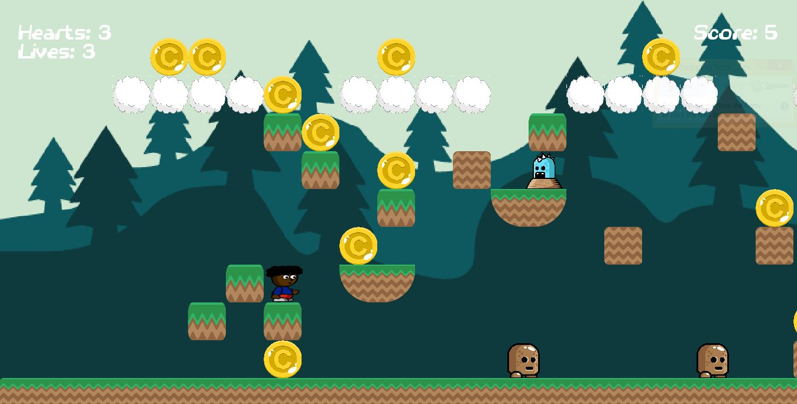
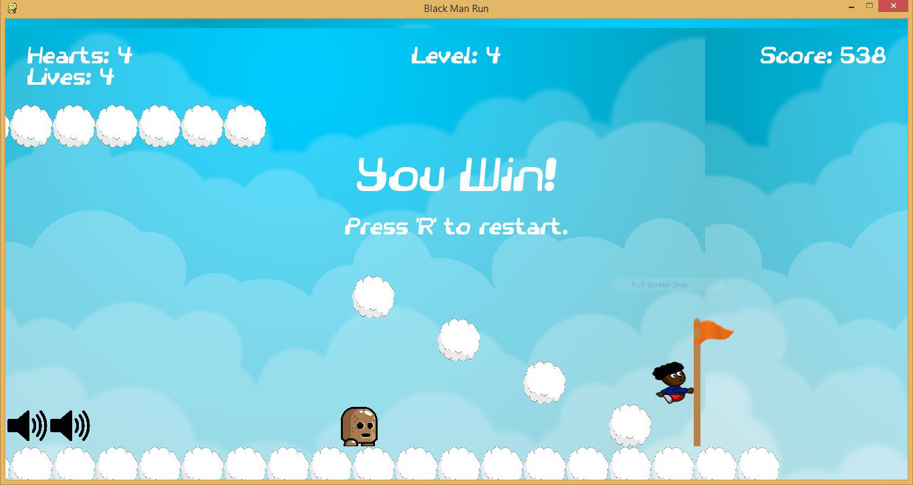

# Black Man Run
This game is the game of the new ager. This game is perfect if you like gaming. To run and play my game all you need is Python 3.4.3 and the corrisponding pygame.
Download the game here
[Download the game here](https://github.com/queenk15/Black-Man-UN/archive/master.zip)

## How to play the game

Using the keys race through my game:
- up arrow: jump
- left /right arrow: moving forward and backward
- down arrow: nothing yet
- j is the a modifer key that makes you jump higher
- s turns off the sound 
- m turns off the music
- p pauses the game

The enemies:
1. A little brown man that moves until it hits something
2. A character that looks like it is poppinout of the ground moves back and forth on platforms

The powerups/ things to earn:
- Hearts give you an extra heart
- The jar of donuts give you an extra life plus one point
- Coins give you 5 points
- The potion takes away 1 life and 5 points
- The jar of peppermints gives you 10 points

Obstacles:
- There are holes in the game that you can fall through 

The goal of the game:
- To have fun and get to last achievement which is HOPE!

## Coming Soon

In my next version of this game I will adding:

1. New worlds
2. Making it more user friendly

